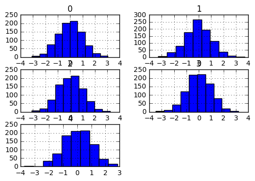

# Readme text for datamunger package
datamunger uses a K-Nearest Neighbors approach to impute both outliers and missing data.
for each column and each nan within the column of a dataframe, datamunger uses the other available columns to build a geometry for which kNN's can be used to impute the missing data point.

Notes:
- multicore doesn't handle well in windows.  There is the option to use multicore on both the embarassing loop thru columns but also the knn fit as available via scikit-learn.  right now, multicore is hardcoded to n_jobs=1 in the scikit-learn fit and set to number of available cores for the columnar embarassing loop.


ToDo's:
1) handling for a row of all nan's 

Required Packages:


```python
import numpy as np
import pandas as pd
import random
from sklearn.neighbors import KNeighborsRegressor
import timeit
import sys
from joblib import Parallel, delayed
import importlib
```


```python
sys.path.append('C:/Users/bacro/OneDrive/PythonScripts/MungerProject/datamunger')
```


```python
import imputeKNN as iknn
```

Generate a dataframe of random numbers and then randomly force some of those numbers to be nan's


```python
df = pd.DataFrame(np.random.randn(1000,5))
ix = [(row,col) for row in range (df.shape[0]) for col in range(df.shape[1])]
for row, col in random.sample(ix, int(round(.1*len(ix)))):
    df.iat[row,col]=np.nan
```


```python
# code to remove missing data
start_time = timeit.default_timer()
newdf = iknn.imputeMissingDataKNN(df,30,multicore=False)
elapsed = timeit.default_timer() - start_time
print(elapsed)
```

    1.71197532222
    


```python
# code to remove outliers
start_time = timeit.default_timer()
cleandf = iknn.imputeOutlierKNN(newdf,lower_lim=0.05,upper_lim=0.95,k=30,multicore=False)
elapsed = timeit.default_timer() - start_time
print(elapsed)
```

    1.55103146836
    


```python
mediandf = df.apply(lambda x: x.fillna(x.median()),axis=0)
medoutdf = iknn.outlierToNanDF(mediandf,lower_lim=0.05,upper_lim=0.95,multicore=False)
meddf = medoutdf.apply(lambda x: x.fillna(x.median()),axis=0)
```


```python
%matplotlib inline
cleandf.hist(layout=(3,2))
```


    array([[<matplotlib.axes._subplots.AxesSubplot object at 0x000000000E79C0F0>,
            <matplotlib.axes._subplots.AxesSubplot object at 0x000000000D6270F0>],
           [<matplotlib.axes._subplots.AxesSubplot object at 0x000000000CED7898>,
            <matplotlib.axes._subplots.AxesSubplot object at 0x000000000CF7C9B0>],
           [<matplotlib.axes._subplots.AxesSubplot object at 0x000000000D33D9E8>,
            <matplotlib.axes._subplots.AxesSubplot object at 0x000000000D3D4DA0>]], dtype=object)


```python
df.hist(layout=(3,2))
```


    array([[<matplotlib.axes._subplots.AxesSubplot object at 0x00000000107259B0>,
            <matplotlib.axes._subplots.AxesSubplot object at 0x0000000010415320>],
           [<matplotlib.axes._subplots.AxesSubplot object at 0x0000000010A18D30>,
            <matplotlib.axes._subplots.AxesSubplot object at 0x0000000010ACC1D0>],
           [<matplotlib.axes._subplots.AxesSubplot object at 0x0000000010B86BE0>,
            <matplotlib.axes._subplots.AxesSubplot object at 0x0000000010AE4F28>]], dtype=object)





```python
meddf.hist(layout=(3,2))
```


    array([[<matplotlib.axes._subplots.AxesSubplot object at 0x00000000111BC5F8>,
            <matplotlib.axes._subplots.AxesSubplot object at 0x0000000010F6F198>],
           [<matplotlib.axes._subplots.AxesSubplot object at 0x00000000114C5B00>,
            <matplotlib.axes._subplots.AxesSubplot object at 0x0000000010646CF8>],
           [<matplotlib.axes._subplots.AxesSubplot object at 0x000000001163B208>,
            <matplotlib.axes._subplots.AxesSubplot object at 0x00000000116B2A90>]], dtype=object)


```python

```
