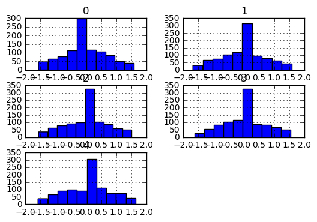
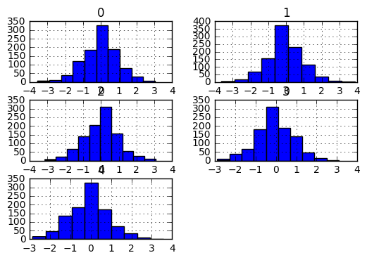

```python
import numpy as np
import pandas as pd
import random
from sklearn.neighbors import KNeighborsRegressor
import timeit
import sys
from joblib import Parallel, delayed
import importlib
```


```python
sys.path.append('/datamunger')
```


```python
import imputeKNN as iknn
```


```python
df = pd.DataFrame(np.random.randn(1000,5))
ix = [(row,col) for row in range (df.shape[0]) for col in range(df.shape[1])]
for row, col in random.sample(ix, int(round(.1*len(ix)))):
    df.iat[row,col]=np.nan
```


```python
df.head()
```


<div>
<table border="1" class="dataframe">
  <thead>
    <tr style="text-align: right;">
      <th></th>
      <th>0</th>
      <th>1</th>
      <th>2</th>
      <th>3</th>
      <th>4</th>
    </tr>
  </thead>
  <tbody>
    <tr>
      <th>0</th>
      <td>NaN</td>
      <td>-0.405989</td>
      <td>0.295981</td>
      <td>-0.526300</td>
      <td>1.145245</td>
    </tr>
    <tr>
      <th>1</th>
      <td>0.302822</td>
      <td>1.484632</td>
      <td>-0.680715</td>
      <td>0.167210</td>
      <td>-0.282413</td>
    </tr>
    <tr>
      <th>2</th>
      <td>-0.350472</td>
      <td>-0.375773</td>
      <td>NaN</td>
      <td>1.094130</td>
      <td>0.317750</td>
    </tr>
    <tr>
      <th>3</th>
      <td>0.310562</td>
      <td>0.515591</td>
      <td>-1.689293</td>
      <td>0.622763</td>
      <td>-0.958986</td>
    </tr>
    <tr>
      <th>4</th>
      <td>0.637836</td>
      <td>NaN</td>
      <td>-0.020487</td>
      <td>0.584991</td>
      <td>0.732111</td>
    </tr>
  </tbody>
</table>
</div>


```python
reload(iknn)
```


    <module 'imputeKNN' from 'imputeKNN.py'>


```python
# code to remove missing data
start_time = timeit.default_timer()
newdf = iknn.imputeMissingDataKNN(df,30,multicore=False)
elapsed = timeit.default_timer() - start_time
print(elapsed)
```

    1.51469581899
    


```python
# code to remove outliers
start_time = timeit.default_timer()
cleandf = iknn.imputeOutlierKNN(newdf,lower_lim=0.05,upper_lim=0.95,k=30,multicore=False)
elapsed = timeit.default_timer() - start_time
print(elapsed)
```

    1.57565181645
    


```python
df.head()
```


<div>
<table border="1" class="dataframe">
  <thead>
    <tr style="text-align: right;">
      <th></th>
      <th>0</th>
      <th>1</th>
      <th>2</th>
      <th>3</th>
      <th>4</th>
    </tr>
  </thead>
  <tbody>
    <tr>
      <th>0</th>
      <td>NaN</td>
      <td>-0.405989</td>
      <td>0.295981</td>
      <td>-0.526300</td>
      <td>1.145245</td>
    </tr>
    <tr>
      <th>1</th>
      <td>0.302822</td>
      <td>1.484632</td>
      <td>-0.680715</td>
      <td>0.167210</td>
      <td>-0.282413</td>
    </tr>
    <tr>
      <th>2</th>
      <td>-0.350472</td>
      <td>-0.375773</td>
      <td>NaN</td>
      <td>1.094130</td>
      <td>0.317750</td>
    </tr>
    <tr>
      <th>3</th>
      <td>0.310562</td>
      <td>0.515591</td>
      <td>-1.689293</td>
      <td>0.622763</td>
      <td>-0.958986</td>
    </tr>
    <tr>
      <th>4</th>
      <td>0.637836</td>
      <td>NaN</td>
      <td>-0.020487</td>
      <td>0.584991</td>
      <td>0.732111</td>
    </tr>
  </tbody>
</table>
</div>


```python
cleandf.head()
```


<div>
<table border="1" class="dataframe">
  <thead>
    <tr style="text-align: right;">
      <th></th>
      <th>0</th>
      <th>1</th>
      <th>2</th>
      <th>3</th>
      <th>4</th>
    </tr>
  </thead>
  <tbody>
    <tr>
      <th>0</th>
      <td>-0.262658</td>
      <td>-0.405989</td>
      <td>0.295981</td>
      <td>-0.526300</td>
      <td>1.145245</td>
    </tr>
    <tr>
      <th>1</th>
      <td>0.302822</td>
      <td>1.484632</td>
      <td>-0.680715</td>
      <td>0.167210</td>
      <td>-0.282413</td>
    </tr>
    <tr>
      <th>2</th>
      <td>-0.350472</td>
      <td>-0.375773</td>
      <td>-0.005060</td>
      <td>1.094130</td>
      <td>0.317750</td>
    </tr>
    <tr>
      <th>3</th>
      <td>0.310562</td>
      <td>0.515591</td>
      <td>-0.055195</td>
      <td>0.622763</td>
      <td>-0.958986</td>
    </tr>
    <tr>
      <th>4</th>
      <td>0.637836</td>
      <td>0.008554</td>
      <td>-0.020487</td>
      <td>0.584991</td>
      <td>0.732111</td>
    </tr>
  </tbody>
</table>
</div>


```python
mediandf = df.apply(lambda x: x.fillna(x.median()),axis=0)
mediandf.head()
```


<div>
<table border="1" class="dataframe">
  <thead>
    <tr style="text-align: right;">
      <th></th>
      <th>0</th>
      <th>1</th>
      <th>2</th>
      <th>3</th>
      <th>4</th>
    </tr>
  </thead>
  <tbody>
    <tr>
      <th>0</th>
      <td>0.030099</td>
      <td>-0.405989</td>
      <td>0.295981</td>
      <td>-0.526300</td>
      <td>1.145245</td>
    </tr>
    <tr>
      <th>1</th>
      <td>0.302822</td>
      <td>1.484632</td>
      <td>-0.680715</td>
      <td>0.167210</td>
      <td>-0.282413</td>
    </tr>
    <tr>
      <th>2</th>
      <td>-0.350472</td>
      <td>-0.375773</td>
      <td>0.019144</td>
      <td>1.094130</td>
      <td>0.317750</td>
    </tr>
    <tr>
      <th>3</th>
      <td>0.310562</td>
      <td>0.515591</td>
      <td>-1.689293</td>
      <td>0.622763</td>
      <td>-0.958986</td>
    </tr>
    <tr>
      <th>4</th>
      <td>0.637836</td>
      <td>-0.036534</td>
      <td>-0.020487</td>
      <td>0.584991</td>
      <td>0.732111</td>
    </tr>
  </tbody>
</table>
</div>


```python
%matplotlib inline
cleandf.hist(layout=(3,2))
```


    array([[<matplotlib.axes._subplots.AxesSubplot object at 0x0000000010551668>,
            <matplotlib.axes._subplots.AxesSubplot object at 0x0000000010683A90>],
           [<matplotlib.axes._subplots.AxesSubplot object at 0x0000000010C59438>,
            <matplotlib.axes._subplots.AxesSubplot object at 0x0000000010D41860>],
           [<matplotlib.axes._subplots.AxesSubplot object at 0x0000000010DC9208>,
            <matplotlib.axes._subplots.AxesSubplot object at 0x0000000010D5D828>]], dtype=object)


```python
df.hist(layout=(3,2))
```


    array([[<matplotlib.axes._subplots.AxesSubplot object at 0x000000001145DD68>,
            <matplotlib.axes._subplots.AxesSubplot object at 0x00000000111C2278>],
           [<matplotlib.axes._subplots.AxesSubplot object at 0x000000001171BBE0>,
            <matplotlib.axes._subplots.AxesSubplot object at 0x00000000117D0128>],
           [<matplotlib.axes._subplots.AxesSubplot object at 0x0000000011890B38>,
            <matplotlib.axes._subplots.AxesSubplot object at 0x00000000117E9DA0>]], dtype=object)





```python
mediandf.hist(layout=(3,2))
```


    array([[<matplotlib.axes._subplots.AxesSubplot object at 0x000000001124C4E0>,
            <matplotlib.axes._subplots.AxesSubplot object at 0x0000000011C26550>],
           [<matplotlib.axes._subplots.AxesSubplot object at 0x0000000012199DD8>,
            <matplotlib.axes._subplots.AxesSubplot object at 0x000000001224E278>],
           [<matplotlib.axes._subplots.AxesSubplot object at 0x000000001234BB00>,
            <matplotlib.axes._subplots.AxesSubplot object at 0x0000000012456668>]], dtype=object)





```python

```
